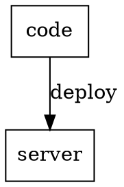
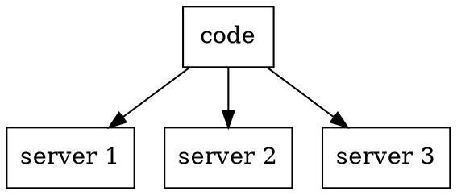

# Deployment WIP

## Что это такое?

Сайт - это программа. Даже если сайт состоит только из HTML, этот HTML можно рассматривать как инструкцию для браузера (что и как отображать).

При локальной разработке, сайт находится у Вашем на компьютере. Чтобы сделать сайт доступным для пользователей по сети, нужно сделать так, чтобы компьютер, на котором находится этот сайт, также был доступен по сети, и мог обмениваться с пользователями данными.

Для этого существуюет 2 варианта:

1. Сделать ваш собственный компьютер доступным по сети. Годится для прототипирования и обсуждения сайта с коллегами. Ваши изменения в коде будут видны сразу же (и любые ошибки - тоже). Как только вы отключились от сети или выключили компьютер, сайт перестанет быть доступным.

2. Переложить сайт на другой, выделенный компьютер (сервер). Он постоянно включён и доступен по сети, за исключением периодов обслуживания. Разработка ведётся по прежнему на вашем ПК, следовательно код, однажды попав на сервер не изменяется до следующего обновления.

Процесс доставки новой версии сайта на сервер и назвается **deployment** (или **deploy**).

В этот процесс входит не только обновление кода, но и как правило сжатие и обфускация скриптов, сжатие картинок, запуск / перезапуск сопутствующих программ или компонент, обновление структуры базы данных, обновление самих данных и многое другое.

Часто сервер может быть не один

## Самый простой деплой

Один из самых простых деплоев - это просто скачать исходный код и перезапустить сервер.

