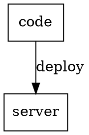
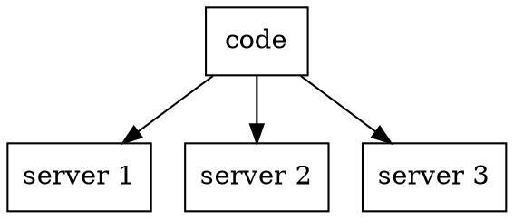

# Deployment (WIP)

## Что это такое?

> **deployment** (или **deploy**) - это процесс доставки новой версии сайта на сервер

Сайт - это программа. Даже если сайт состоит только из HTML, этот HTML можно рассматривать как инструкцию для браузера (что и как отображать).

При локальной разработке, сайт находится на Вашем компьютере. Чтобы сделать сайт доступным для пользователей по сети, нужно сделать так, чтобы компьютер, на котором находится этот сайт, также был доступен по сети, и мог обмениваться с пользователями данными.

Для этого существует 2 варианта:

1. Сделать ваш собственный компьютер доступным по сети. Годится для прототипирования и обсуждения сайта с коллегами. Ваши изменения в коде будут видны сразу же (и любые ошибки - тоже). Как только вы отключились от сети или выключили компьютер, сайт перестанет быть доступным.

2. Переложить сайт на другой, выделенный компьютер (сервер). Он постоянно включён и доступен по сети, за исключением периодов обслуживания. Разработка ведётся по прежнему на вашем ПК, следовательно код, однажды попав на сервер не изменяется до следующего обновления.

Процесс доставки новой версии сайта на сервер и назвается **deployment** (или **deploy**).



В этот процесс входит не только обновление кода, но и как правило сжатие и обфускация скриптов, сжатие картинок, запуск / перезапуск сопутствующих программ или компонент, обновление структуры базы данных, обновление самих данных и многое другое.

Часто сервер может быть не один



Ввиду того, что это однообразная рутинная задача, deploy автоматизируют, которую, к тому же, нужно выполнить сразу на множестве серверов, его автоматизируют.

## Самый простой деплой

Один из самых простых деплоев - это просто зайти на сервер, где работает ваш сайт, скачать исходный код и перезапустить ваш веб-сервер (node, nginx, puma, apache и т.д.)

(ip адрес здесь - просто пример)

```bash
ssh root@127.0.10.10
cd ~/project/
git pull
```

Перезагрузка сервера делается разными способами.

Как один из возможных вариантов:

```bash
ps xa | grep node 
kill -2 PID
node server.js &
```

Наверняка вы хотите, чтобы ваш процесс работал в background, т.к. как только вы отключиесь от ssh ваш процесс должен продолжать работу. Вариантов опять же масса, такие как `nohup`, `systemd` и многие другие.

Чтобы не перезагружать сервер руками, а просто делать `git pull` настраивают разнообразные утилиты (watcher-ы, listener-ы), которые следят за изменениями кода на вашем сервере и перезагружают ваш веб-сервер.

---

WIP