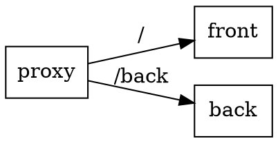

# Как не перекомпилировать JS

Предположим есть приложение состоящее из двух частей *Front* и *Back*.
*Front* часть должна знать URL *Back* части. При этом *Front* статичная часть.
Как передать туда URL *Back* части без перекомпиляции?

Поставьте перед вашим приложением proxy сервер и настройте проксирование на *Back* по отдельному пути.

В таком случае, во *Front* части достаточно написать только относительный путь, например `/back`,
запрос уйдёт на прокси сервер, а потом на *Back*.
