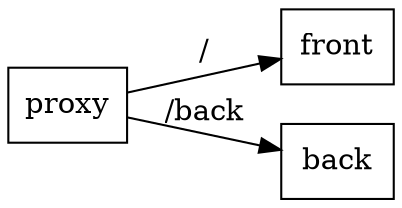

# Ссылка из статичного фронта на бэк

Предположим есть приложение состоящее из двух частей: *Front* и *Back*.

*Front* - чистый js, статика, должен знать URL *Back* части.

Как передать туда URL *Back* части без перекомпиляции?

Поставьте перед вашим приложением proxy сервер и настройте проксирование на *Back* по отдельному пути.

В таком случае, во *Front* части достаточно написать только относительный путь, например `/back`,
запрос уйдёт на прокси сервер, а потом на *Back*.

[Назад](index.md)